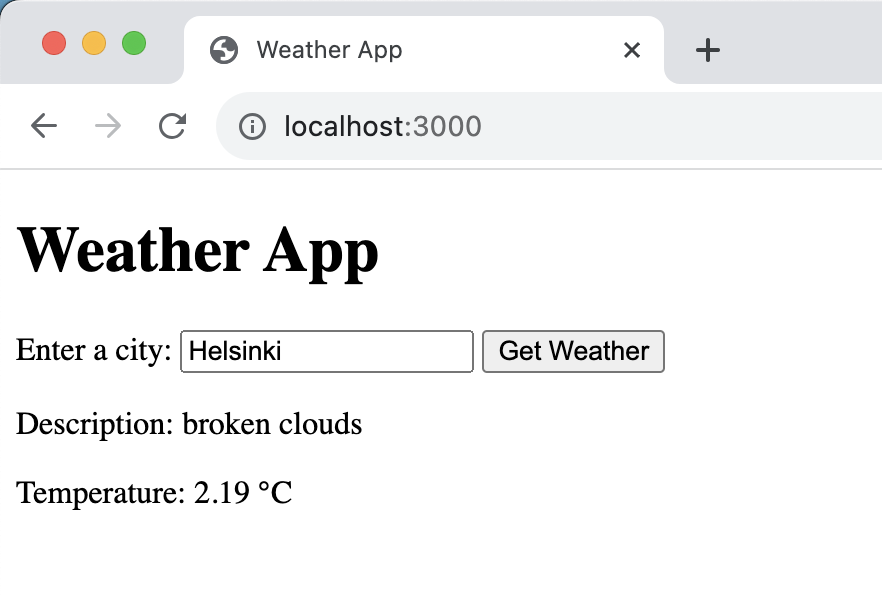
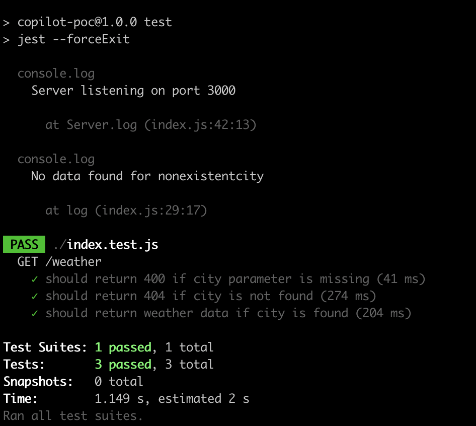

# GitHub Copilot PoC
A PoC on GitHub copilot. All code in this repository was generated by giving Copilot instrcutions described in the following steps.

1. I created a file called weather-query.js
1. Copilot: "*Generate a function that displays the weather in Helsinki*"
1. Copilot: "*Make this application executable from the command prompt*". After this I was able to query for weather data in the command line.
1. Copilot: "*Change the application so that it doesn't crash if no data is found for the given city*". After this the application displayed an error message for imaginary cities.
1. Copilot: "*Change the code so that the API key is read from an environment varibale called WEATHER_API_KEY*"
1. Copilot "*Change the code so that the application exits with a message if the environment variable WEATHER_API_KEY is not defined*"
1. Let's make this into a simple web app. I copied to code to a file called index.js.
1. Copilot: "*Convert this into a web application with a web UI*."
1. Copilot: "*Add Express as a dependency. Add a run command that starts the Express web server.*" After this I was able to run the web server and make queries to a REST API.
1. Copilot "*Change the /weather endpoint so that it doesn't crash if city parameter is not defined.*"
1. Copilot: "*Create a web UI in index.html that uses this REST API as its backend.*"
1. Copilot: "*Display a message to the user if the response code was 'not found'*." After this I was able to browse to localhost:3000 and see a simple web UI and make queries of existing and non-existing cities.
1. Copilot: "*Generate unit tests for this REST API*."
1. Copilot: "*Add dev dependencies for Jest and Supertest.*" Aftr this I was able to run the three generated unit tests successfully on the command line.

